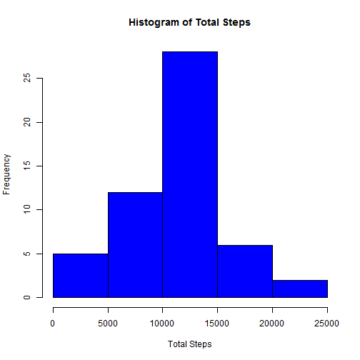
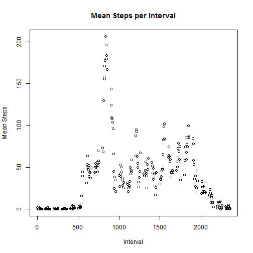
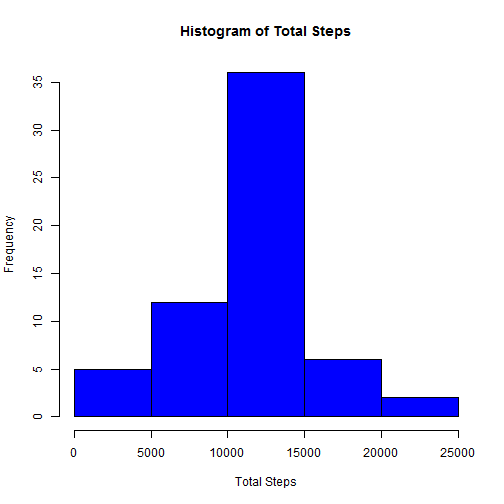
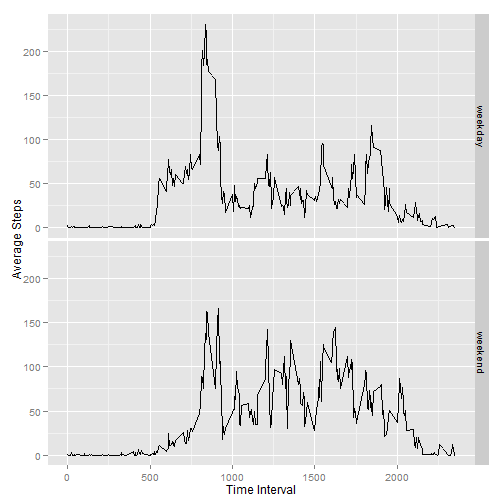

### Loading and Preprocessing the Data.

(1) Load the data.

```r
## Create a variable for the working directory
work_dir <- "c:/users/toothill/RepData_PeerAssessment1"
activity_df <- read.csv(paste(work_dir,"/activity.csv", sep = ""))
```

(2) Process/format data as need for analysis.

```r
activity_df$date <- as.Date(activity_df$date, format = "%Y-%m-%d")
str(activity_df)
```

```
## 'data.frame':	17568 obs. of  3 variables:
##  $ steps   : int  NA NA NA NA NA NA NA NA NA NA ...
##  $ date    : Date, format: "2012-10-01" "2012-10-01" ...
##  $ interval: int  0 5 10 15 20 25 30 35 40 45 ...
```


### What is Mean Total Number of Steps Taken per Day?

(1) Calculate the total number of steps taken per day.

```r
tot_steps_df <- aggregate(steps ~ date, activity_df, sum)
```

(2) Make a histogram of the total number of steps taken per day.

```r
hist(tot_steps_df$steps, xlab = "Total Steps", col = "blue", main = "Histogram of Total Steps")
```

 

(3) Calculate and report the mean & median of the total number of steps taken per day.

```r
mean(tot_steps_df$steps)
```

```
## [1] 10766.19
```

```r
median(tot_steps_df$steps)
```

```
## [1] 10765
```

### What is the Average Daily Activity Pattern?

(1) Make a time series plot of 5-minute interval and average nbr of steps taken across all days.

```r
interval_df <- aggregate(steps ~ interval, activity_df, mean)
plot(interval_df$interval, interval_df$steps, main = "Mean Steps per Interval", xlab = "Interval", ylab = "Mean Steps")
```

 

(2) Which 5-minute interval contains the max number of average steps?

```r
interval_df[interval_df$steps == max(interval_df$steps), c("interval", "steps")]
```

```
##     interval    steps
## 104      835 206.1698
```

### Imputing Missing Values
(1) Number of rows with "NAs"

```r
complete_row <- complete.cases(activity_df)
nrow(activity_df[!complete_row, ])
```

```
## [1] 2304
```

(2) Strategy for completing missing values.

For rows with NA in the <steps> column, replace NA with the average # of steps for the interval across the entire dataset. 

(3) New dataset with missing values filled in

```r
activity2_df <- activity_df
num_rows <- nrow(activity2_df)
## Loop through rows in DF and replace NAs with average for given interval
for (i in 1:num_rows) 
  if(is.na(activity2_df[i, ]$steps))  
    activity2_df[i, "steps"] <- interval_df[interval_df$interval == activity2_df[i, ]$interval, "steps"]
```

(4)  Histogram of total number of steps per day.  Mean/Median of steps taken per day.

```r
tot_steps2_df <- aggregate(steps ~ date, activity2_df, sum)
hist(tot_steps2_df$steps, xlab = "Total Steps", col = "blue", main = "Histogram of Total Steps")
```

 

```r
mean(tot_steps2_df$steps)
```

```
## [1] 10766.19
```

```r
median(tot_steps2_df$steps)
```

```
## [1] 10766.19
```

Yes, the values differ from first part of assignment.  
Total daily number of steps increases as a result of imputing missing values.


### Difference in Activity Patterns between Weekdays and Weekends

(1) Create a factor with 2 level: "weekday" & "weekend"

```r
activity3_df <- activity2_df
num_rows <- nrow(activity3_df)
activity3_df$week_vs_weekend <- "weekday"
## Loop through DF and assign "Weekend" to Saturday's and Sunday's
for (i in 1:num_rows) 
  if ((weekdays(activity3_df[i, "date"]) %in% c("Saturday", "Sunday"))) 
    activity3_df[i, ]$week_vs_weekend <- "weekend"
activity3_df$week_vs_weekend <- as.factor(activity3_df$week_vs_weekend)
```

(2) Plot containing time seriers of interval (x-axis) and average steps take (y-axis)

```r
library(ggplot2)
interval2_df <- aggregate(activity3_df["steps"], by=activity3_df[c("interval","week_vs_weekend")], FUN = mean)
qplot(interval, steps, data = interval2_df, facets = week_vs_weekend ~ ., xlab = "Time Interval", ylab = "Average Steps", geom="line")
```

 
